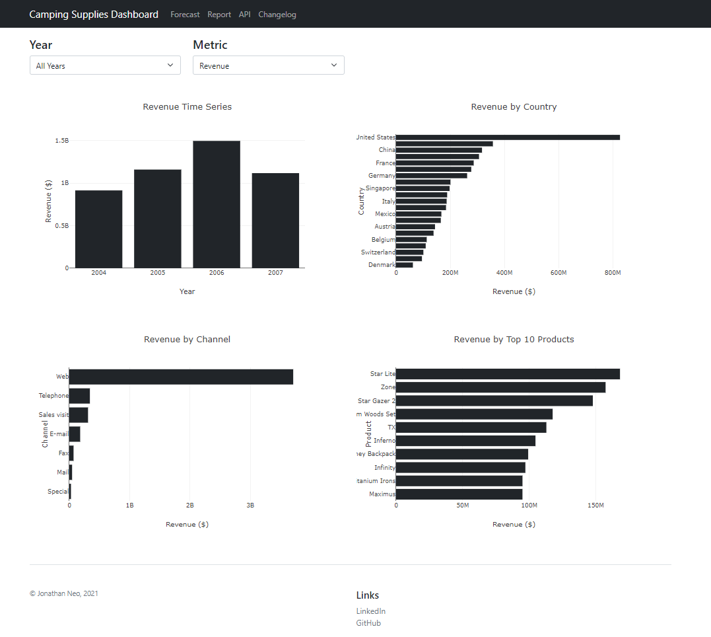
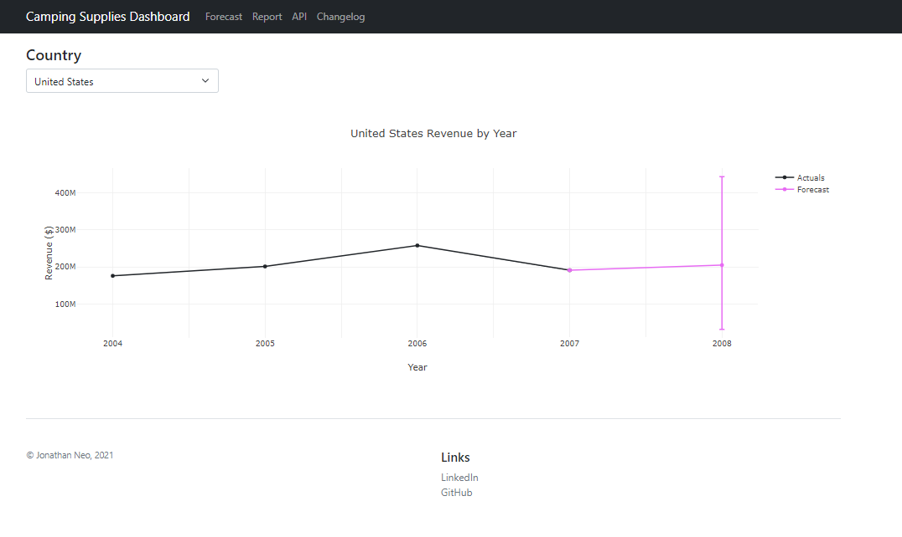
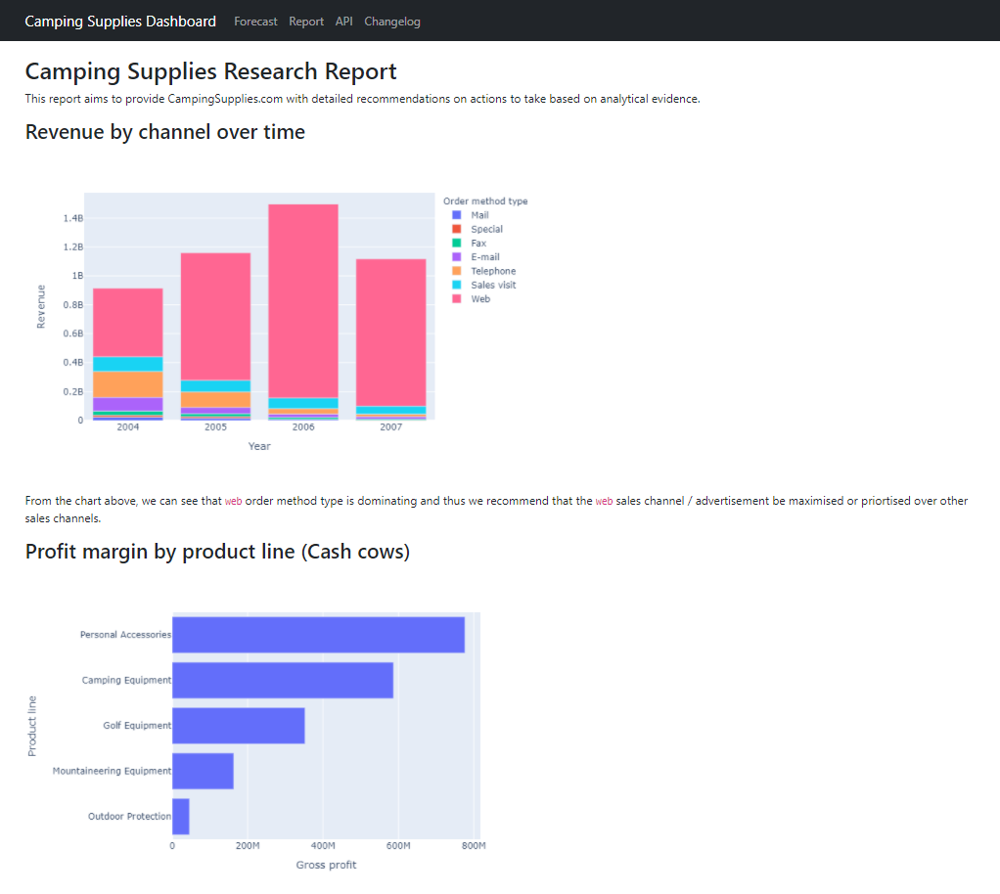
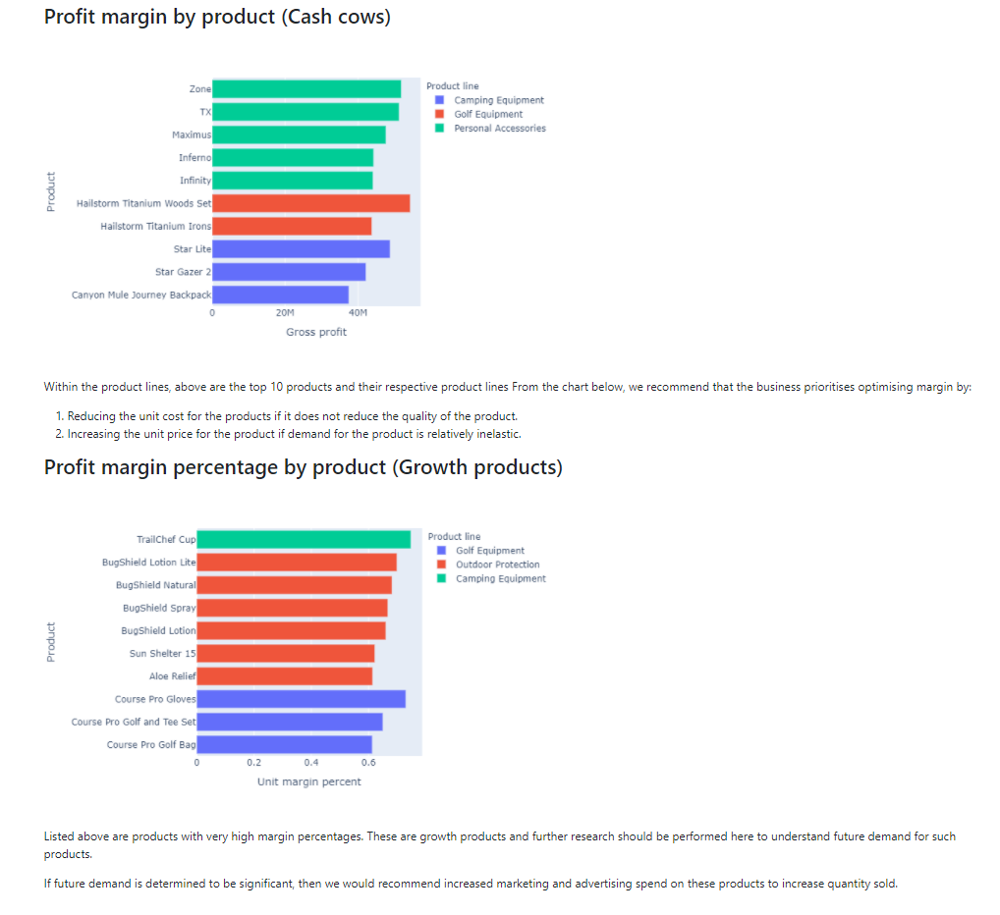
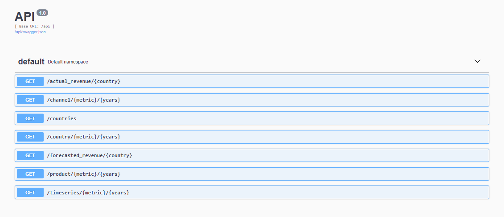
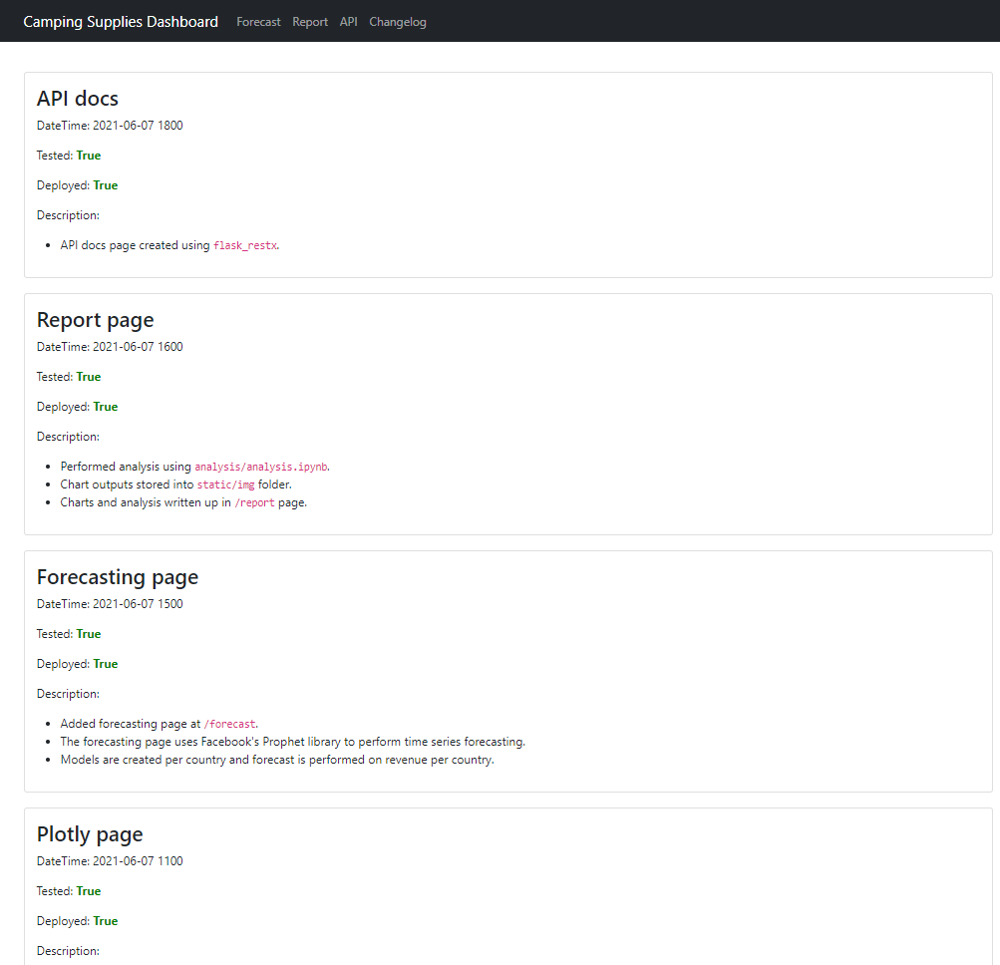

# Overview

I have created a dashboard using Flask to help a fictitious business ("Camping Supplies Store") answer some questions about their financials and forecast sales for the next year.

I have a demo app running on: [https://retail-challenge-lite.herokuapp.com/](https://retail-challenge-lite.herokuapp.com/)

Below are screenshots of what the app looks like when running:

### Index Page



[Plotly JS](https://plotly.com/javascript/) was used to render the data onto the page by querying the API endpoints created.

### Forecast page



Forecasts are performed in real-time using an API I wrote with a fitted model using [Facebook Prophet](https://facebook.github.io/prophet/docs/quick_start.html).

### Report Pages





This page was created by rendering markdown using [Python Markdown](https://github.com/Python-Markdown/markdown).

### API page



API docs were created using [Flask RESTX](https://flask-restx.readthedocs.io/en/latest/).

### Changelog page



This page was created by rendering markdown using [Python Markdown](https://github.com/Python-Markdown/markdown). Each change log is written in markdown and rendered onto the page as cards.

# Running locally

1. Freeze pip / conda requirements

   ```
   python -m pip list --format=freeze > requirements.txt
   ```

2. Create the environment using

   ```
   conda create -n <env> --file requirements.txt
   ```

3. Run the app using:

   ```
   python app.py
   ```

   OR

   ```
   flask run
   ```

# Deploying to Heroku

1. Freeze pip / conda requirements

   ```
   python -m pip list --format=freeze > requirements.txt
   ```

2. Create/Update `Procfile` to use gunicorn to run the web server and set app.py as the application to run:

   ```
   web: gunicorn app:app
   ```

3. Create/Update `runtime.txt` to contain:

   ```
   python-3.7.10
   ```
